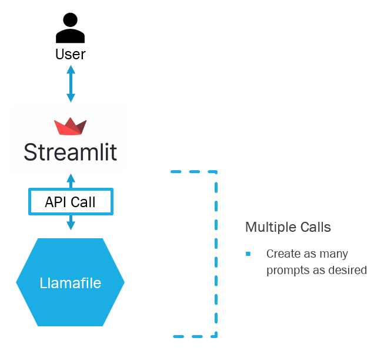

# Prompt Enhancer with a Local LLM
A systematic prompt enhancer with a local LLM (using llamafile) for increased security and portability.

After years of bad press from hacks and data leaks, corporate employees are facing increased pressure to keep their company's information safe. Many corporations have even taken the stance that employees must not use online LLMs, such as ChatGPT, for fear of what the employees may share (trade secrets, strategies, upcoming plans, etc.). Some employees looking to use the latest AI tools find themselves unable to convince their security and legal teams to accept the risk.

This tool overcomes the risks by allowing users to interact with an LLM in a safe and secure manner. In addition, this tool is designed for prompt enhancements specific to your purpose and industry. Through answering 7 short questions, users can seek improved outputs from the LLM. This prompt enhancement is especially helpful for those less accustomed to LLMs, or those with little training in prompt engineering.

## Why This Product?
- 100% local, 100% private, can be run without an internet connection
- For Windows, Mac, and Linux machines
- For use on both:
  - CPU only machine
  - GPU machine (Can detect and use your GPU, whether it is from Apple, NVIDIA, or AMD)
- Open Source
- Free
- Prompt enhancement naturally built into easy 7 step process

## App Use

### Demonstration

### First Stage: Prompt Entry
At the opening page of the app, you have the ability to write your prompt which the LLM will later answer.

  

### Second Stage: Prompt Enhancement
There are seven ways in which you can enhance your prompt, or you can skip ahead by clicking the Finish Process button.

Below is one of the seven enhancements: a dropdown to enter the purpose of the response. In this example the user wants the response in the form of a business email.

  

### End Stage & Beyond: Model Output
At this stage, the model responds to your enhanced prompt. This may take a few seconds to run based on your computer's speed. 

In this example, the LLM produced a business email as requested.

At the bottom of the page is an option to run another prompt.

  

### Try the Functionality
Follow the instructions below to get the app up and running. Then try your own prompts and enhancements to find what options work best for you.

## App Setup
### Overview
The interface of the tool is within a Docker image, which will be made into a Docker container. The Llamafile is located outside the Docker container. The Docker container and Llamafile will be setup to communicate with each other. The result will be a locally hosted app which users can interact with through their web browser.

### Docker Image
#### Download the Docker Image
Using a bash terminal, pull the image from DockerHub (ensure that Docker Desktop is running)
- `docker pull jaredbaileyduke/local-prompt-enhancer:latest`

#### Create a Running Container
Using the downloaded image, create a running container which can communicate with both the the web browser and Llamafile.
- `docker run -d -p 8501:8501 jaredbaileyduke/local-prompt-enhancer`

### Llamafile
#### Download a Llamafile
Executible LLMs can be found at the following GitHub repostitory:

  <a href="https://github.com/Mozilla-Ocho/llamafile" target="_blank">
  https://github.com/Mozilla-Ocho/llamafile
  </a>

I recommend choosing a smaller LLM in order to ensure the best speed performance. For personal use, I've selected TinyLlama from Meta due to it's fast responses and robust answers.

#### Run the Llamafile (Windows)
The Llamafile file can be run two different ways

Using Bash, start the executible:
- `./path-to-model/model.llamafile --server --nobrowser -ngl 999`

Or in the GUI:
1) Rename the Llamafile. The new name should end in .exe
  - For example, TinyLlama-1.1B-Chat-v1.0.F16.llamafile should now be named TinyLlama-1.1B-Chat-v1.0.F16.llamafile.exe
2) Run the Llamafile by double clicking on the Llamafile to run the executible

#### Run the Llamafile (Mac and Linux)
1) Make the Llamafile executible
  - `chmod +x path-to-model/model.llamafile`
2) Start the executible
  - `./path-to-model/model.llamafile --server --nobrowser -ngl 999`

### Putting it all Together
Go to web browser and enter the url:
- `localhost:8501`

The app is now ready to use.

## Tool Architecture
The architecture was kept sleak and simple. 
- The users interacts with the Streamlit frontend
- The frontend calls an API
- The API call interacts with the LLM, and relays output back to the frontend

  

Included in the repository is optional Rust code for the API call, which can replace the Python code. This code is untested and will be available for use in a future release to allow for improved speed.

## Performance/Evaluation
### Speed
After conducting many tests on my 32GB RAM Windows 11 machine, I've found the use of this app with TinyLlama produces model response times between 12 and 45 secondes. The average response time is near 15 seconds.

I've provided unused Rust code to handle the API call. It is undergoing additional testing and will be implemented in a future release. This functionality reduces the model response time by around 2 seconds on average.

### Accuracy
Mileage will vary based on the model you select. In general:
- Newer models will outperform older ones
- Larger models will outperform smaller ones

My recommendation of TinyLlama provides a good mix of performance and acceptable model responses.